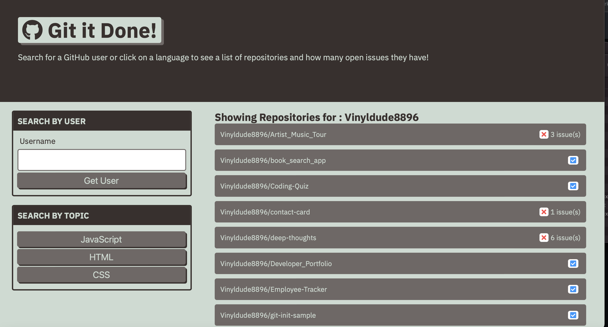
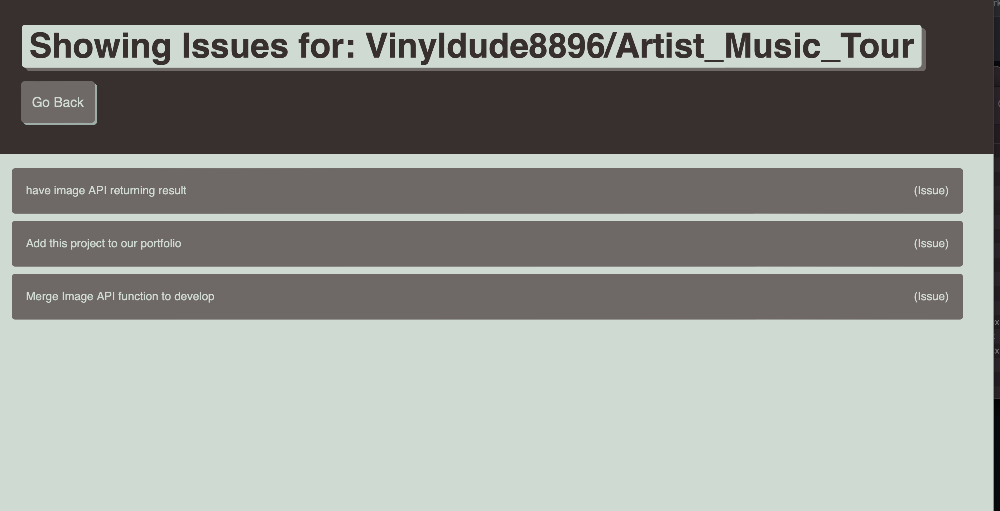

# Git-it-Done

### User Story

As a Developer, I want a web app that I can use to search different GitHub Profiles. When I load the application I should be presented witha search option to seach for a github  user by username. When I search a user, I shgould then be presented a list of their repositories. After searching for a GitHub user and having results returned, I would then like to filter by topic being JavaScript, HTML or CSS. If I click a repo, I should then see all of the outsanding issues for that repository.

### Features
This web application features a search tool, to search for a github user and see all of their repositories.
This application will allow a user to filter by topic after the search results have been returned.
This application also allows a user to click on any repo and see any outsanding issues for that repository
If a User clicks on the issue they will be directed to the github page for that issue.

### Badges

## Table of Contents

- [installation](#installation)
- [contribution guidelines](#contribution)
- [Test Instructions](#testing)
- [License](#license)
- [Questions](#questions)

### Installation
1. Please clone the github repo here :
https://github.com/Vinyldude8896/git-it-done

### Contribution Guidelines
Current contributers:
Kevin Reid : https://github.com/Vinyldude8896  

### Testing
To test this app: 
1. Clone the repo here : https://github.com/Vinyldude8896/git-it-done  
2. right click the index.html file and open in browser.  
3. Try searching for a GitHub user.
4. After the results have been returned, try filtering by topic.
5. Click any repository that shows active issues.
6. click one of the issues on this next page and you should be directed to the Github Issues page.

### Questions
    email address : kevinnivek@me.com
    - additional instructions 
    I can be contacted by phone as well, but prefer email contact first.
### Images

